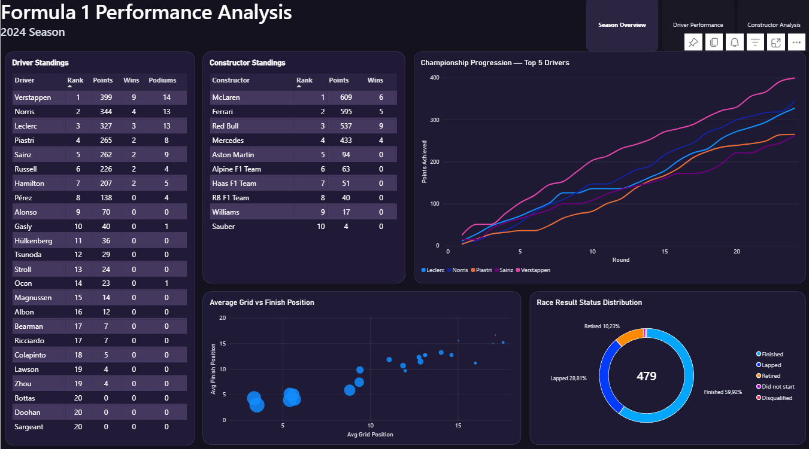
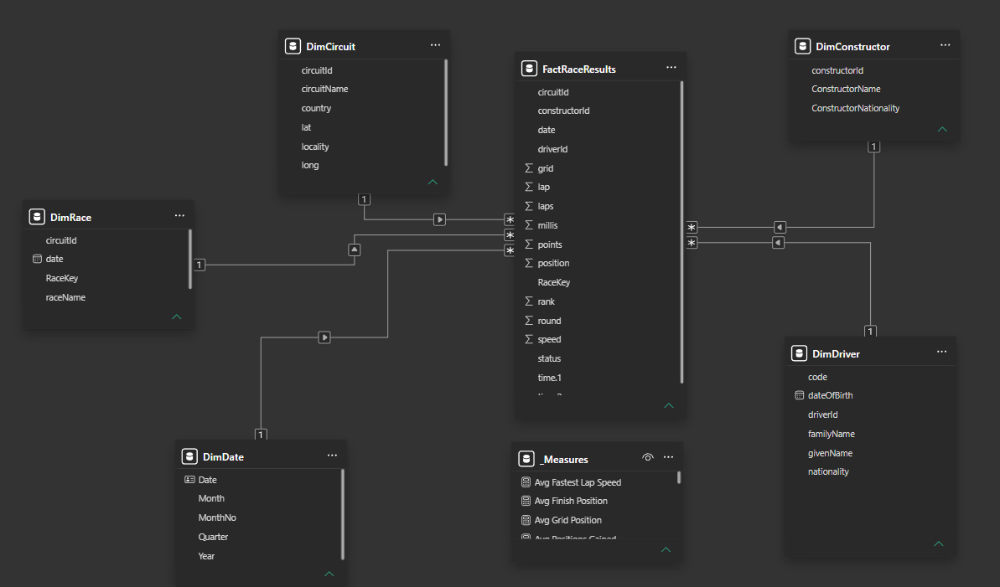
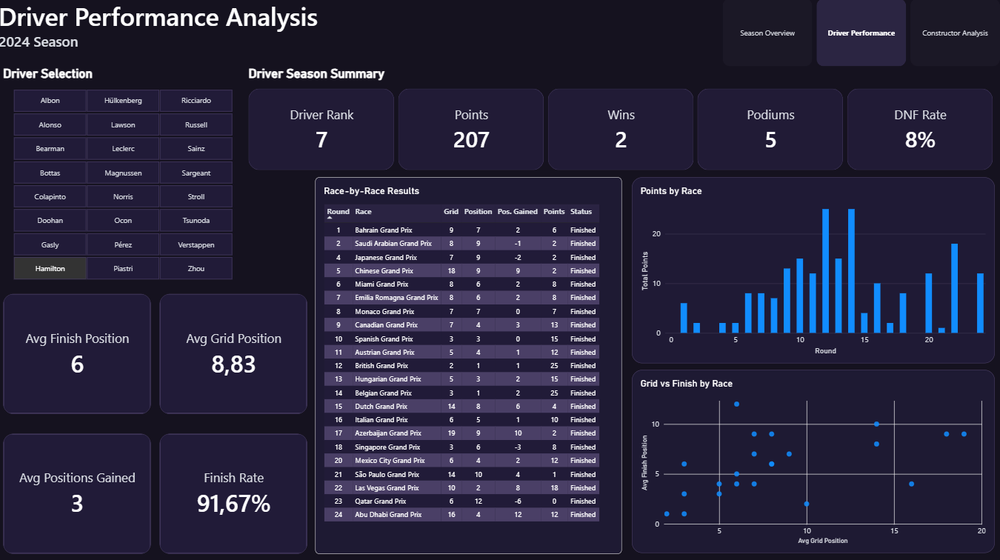
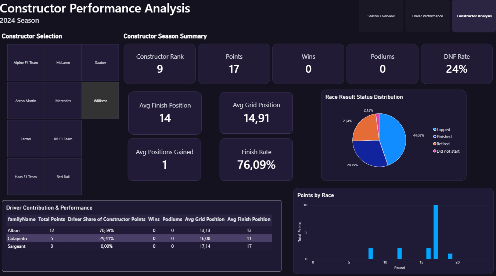

# Formula 1 Performance Analytics

Power BI project analyzing the **2024 Formula 1 season** using data from the **Jolpica / Ergast API**.

The project covers the full BI workflow:
- API data extraction and transformation in Power Query
- staging layer
- star schema data model
- DAX measures
- interactive Power BI dashboards
- performance validation

## Data Model

The report uses a **star schema** with `FactRaceResults` as the central fact table and dedicated dimensions for drivers, constructors, races, circuits and dates.

The main fact table grain is:

> **One row = one driver in one race**

Relationships use **1:* single-direction filtering from dimensions to the fact table**.

## Dashboard Pages

### Season Overview

High-level view of the season including driver and constructor standings, championship progression and overall performance analysis.

### Driver Performance

Interactive analysis of a selected driver, including season KPIs, race-by-race results, points by race and grid vs finish performance.

### Constructor Performance

Interactive constructor analysis including team KPIs, driver contribution, points by race and reliability.

## DAX & Power BI

The project uses DAX for calculations including:

- rankings
- cumulative points
- rolling averages
- DNF and finish rates
- average grid and finish positions
- driver contribution to constructor points

The report was also checked using **Power BI Performance Analyzer** to validate visual and query performance.

## Tools

**Power BI | Power Query | DAX | REST API | JSON | Git | GitHub**

## Files

- `F1-PowerBI.pbix` — complete Power BI report
- `screenshots/` — dashboard and data model previews

[Download the Power BI file](./F1-PowerBI.pbix)
